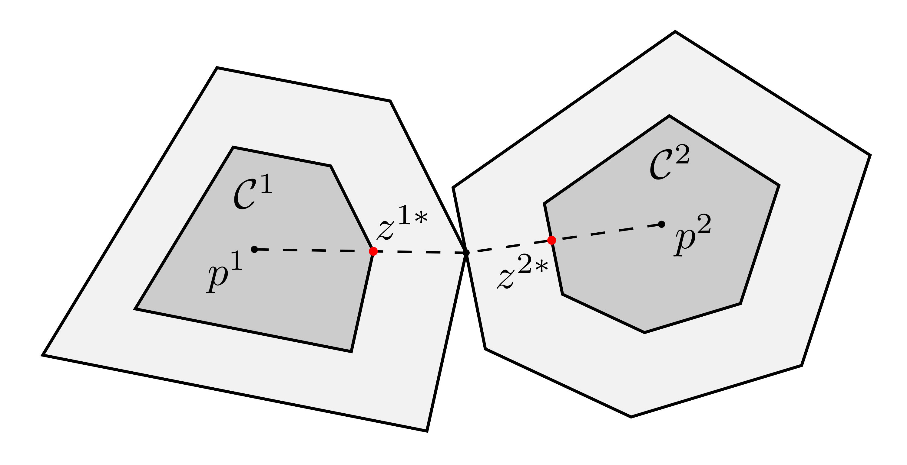

# Differentiable Growth Distance (DGD) Library


## Overview

The growth distance between two convex sets is the minimum factor by which the sets must be scaled, with respect to their center points, such that they intersect (see figure below).

<div align="center">

</div>

The DGD library implements state-of-the-art algorithms for computing growth distances between convex sets in two and three dimensions, as well as the solution derivatives (gradients and Jacobians) with respect to the rigid body transformations.

The codebase is modular, extensible, and leverages modern C++17 features, as well as Eigen for linear algebra.

### Notes:
- Currently, the DGD library has only been tested on Linux (x86_64).
- Solution derivative implementations and a few other solvers will be added soon.


## Table of Contents

- [Features](#features)
- [Performance](#performance)
- [Requirements](#requirements)
- [Building](#building)
  - [CMake Options](#cmake-options)
  - [Testing & Benchmarking](#testing--benchmarking)
- [API Reference & Usage](#api-reference--usage)
- [Troubleshooting](#troubleshooting)
- [Citation](#citation)
- [Key Tags](#key-tags)
- [License](#license)


## Features

### Core Features

- *State-of-the-art growth distance computation* for convex sets in two and three dimensions.
- Early termination for *collision detection*.
- Solution *warm starting*.

### Utilities

- *KKT solution error computation*: Primal and dual infeasibility errors and the log primal-dual gap.
- *Mesh loading* from .obj files (using the *tinyobjloader* library).
- *Fast convex hull computation*:
  - Graham Scan algorithm: Convex hull in 2D.
  - Quick hull algorithm (using the *Qhull* library): Convex hull in 3D:
    - Vertex adjacency graph (V-rep).
    - Facet adjacency graph (H-rep).

### Geometries

- Support for the following convex sets:
  - *2D*: circle, ellipse, polygon, rectangle, and stadium.
  - *3D*: capsule, cone, cuboid, cylinder, ellipsoid, frustum, mesh, polytope, and sphere.
  - *2D/3D*: halfspace.
- Full support for *user-defined compact convex sets*.

### Solvers

- First-order:
  - *Cutting plane*.
  - Proximal bundle (removed, see tag v0.3.0).
- Second-order:
  - *Trust region Newton*:
    - *Partial solution*.
    - Full solution (removed, see tag v0.3.0).

### Testing

- *Extensively tested*: ~10 billion distance computations with:
  - Random transformations.
  - Convex sets with skew (ratio of the circumradius to the inradius) up to 100.
  - Cold and warm start.

<!-- ### Others

- Support for 32-bit float scalar type. -->


## Performance

<!-- TODO: Add performance graphs -->

### Notes

- The benchmarking code can be found here: [dgd-benchmark](https://github.com/AkshayThiru/dgd-benchmark).
- The benchmarks are performed using the runtime (virtual-dispatch) functions. The template functions can be 5-10% faster (see [API Reference & Usage](#api-reference--usage)).
- More details about the benchmarking process can be found in the paper.
<!-- TODO: After adding multiple papers, specify which one. -->


## Requirements

- C++17 compiler (tested with GCC)
- [Eigen](https://eigen.tuxfamily.org/) (version 5.0 or later)
- [Qhull](http://www.qhull.org/) (for convex hull operations and adjacency graph computation)
- CMake (version 3.15 or later)


## Building

1. Clone the repository:
 ```sh
    git clone https://github.com/HybridRobotics/differentiable-growth-distance.git
    cd differentiable-growth-distance
 ```

2. Configure and build with CMake (see [CMake Options](#cmake-options)):
 ```sh
    mkdir build && cd build
    cmake .. -DCMAKE_BUILD_TYPE=Release
    cmake --build . --parallel $(nproc)
 ```

3. Install the library:
 ```sh
    cmake --install . --config Release
 ```

### CMake Options

- `DGD_BUILD_TESTS` (default: ON)    — Build unit tests (requires GoogleTest)
- `DGD_BUILD_BENCHMARKS` (default: ON)    — Build benchmarks (Release mode, double precision only)
- `DGD_BUILD_DOCS` (default: OFF)   — Build documentation (requires Doxygen)
- `DGD_USE_32BIT_FLOAT` (default: OFF)   — Use single precision floats

### Testing & Benchmarking

Build (configure tests and benchmarks via CMake flags):
```sh
mkdir build && cd build
cmake .. -DCMAKE_BUILD_TYPE=Release \
 -DDGD_BUILD_TESTS=ON \
         -DDGD_BUILD_BENCHMARKS=ON \
 -DDGD_USE_32BIT_FLOAT=OFF
cmake --build . --parallel $(nproc)
```

Run all unit tests (uses GoogleTest):
```sh
./tests/dgd_test
```

Run benchmarks (see [growth_distance_bm.cc](benchmarks/growth_distance_bm.cc) for a list of command-line options):
```sh
./benchmarks/dgd_growth_distance_bm
```


## API Reference & Usage

API documentation is generated with Doxygen. To build docs:
```sh
cmake .. -DDGD_BUILD_DOCS=ON
make docs
```

See the [Usage](docs/Usage.md) guide for more in-depth examples.


## Troubleshooting

- **Eigen or Qhull not found:** </br>
 Ensure Eigen is installed and available in the include path. Qhull may need to be installed via the package manager (e.g., `sudo apt install libqhull-dev`).

- **Compiler errors about C++ standard:** </br>
 Ensure that the compiler supports C++17 or a later version.

- **Build errors:** </br>
 Try a clean build (`rm -rf build && mkdir build && cd build && cmake .. && make`).


## Citation

<!-- TODO: different citations for different algorithms -->

If you use this library in your research, please cite:

<!-- TODO: Add CITATION.cff -->
<!-- TODO: add paper citation -->


## Key Tags

- v0.1.0: Initial benchmarking version for the cutting plane method.
- v0.3.0: Removed the proximal bundle and full trust region Newton solvers.


## License

Licensed under the Apache License, Version 2.0. See [LICENSE](LICENSE) for details.

---
